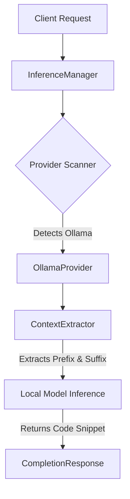

<div align="center">
  
  &nbsp;
  
  <br>
  <h1>🚀 LocalCoD: Your Local AI Code Engine</h1>
  <p><i>Empowering your development workflow with completely local, privacy-first AI generation and code completion.</i></p>

  
</div>

---

## 🌟 Overview

**LocalCoD** is a lightweight, scalable, and fully local AI engine designed to run code completion and text generation workflows entirely on your machine. By bridging directly with local inference servers like **Ollama**, it provides intelligent context extraction without sacrificing data privacy or incurring cloud costs.

<div align="center">
  
</div>

## ✨ Features

- 🔍 **Dynamic Provider Discovery**: Automatically scans your local environment to find running AI providers (e.g., Ollama) and available models.
- 💻 **Smart Code Completion**: Uses a `ContextExtractor` to grab the prefix and suffix of your cursor position, delivering highly accurate middle-fill completions.
- 🗣️ **Text Generation**: Ask questions or prompt generation via the `GenerationRequest` interface.
- ⚡ **Token Limiting**: Enforces max-token limits on requests to guarantee concise code completions without conversational fluff.
- 🌐 **Language Detection**: Automatically determines the programming language from file extensions using `language_detector.py` to optimize model context.
- 🔌 **Extensible Architecture**: Built with simple, standard Python abstractions—no heavy frameworks or complex decorators required.

## 🏗️ Architecture



## 🚀 Quick Start

1. **Install Dependencies** (Ensure `requests` is installed):
   ```bash
   pip install requests
   ```

2. **Start Ollama Locally**:
   Ensure your Ollama server is running with models like `Qwen2.5-Coder:latest`:
   ```bash
   ollama serve
   ```

3. **Run the Engine**:
   Execute the `main.py` entrypoint to see context-aware code completion in action:
   ```bash
   python main.py
   ```

### 💡 Example: Code Completion
```python
from core.inference_manager import InferenceManager
from models.completion_request import CompletionRequest

manager = InferenceManager()

# Code with a missing completion inside a loop
cpp_code = """
for(int i = 0; i < nums.size(); i++) {
    // Missing code here
}
"""

request = CompletionRequest(
    model="Qwen2.5-Coder:latest",
    file_content=cpp_code,
    cursor_position=39,
    language="cpp",
    max_tokens=64
)

response = manager.complete(request)
print(response.text)
# Output: if (nums[i] > maxi) { maxi = nums[i]; }
```

## 📂 Project Structure

- `core/`: Contains the `InferenceManager` that orchestrates and routes requests.
- `discovery/`: Scans and detects installed local providers and available models dynamically.
- `models/`: Clean data classes representing Requests and Responses (`CompletionRequest`, `CompletionContext`).
- `providers/`: Interfaces and implementations for AI backends (`OllamaProvider`).
- `context/`: `ContextExtractor` logic for splitting prefix and suffix text.
- `utils/`: Helpful utilities like file extension language mapping (`language_detector.py`).

## 🤝 Contributing
Contributions, issues, and feature requests are highly welcome!

<div align="center">
  Made with ❤️ by the LocalCoD Community
</div>
